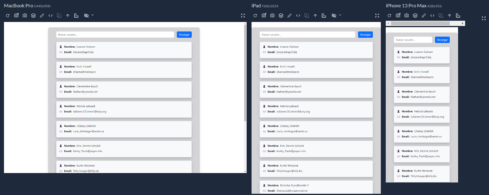
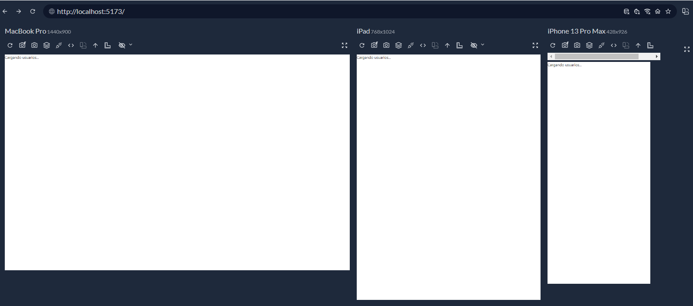
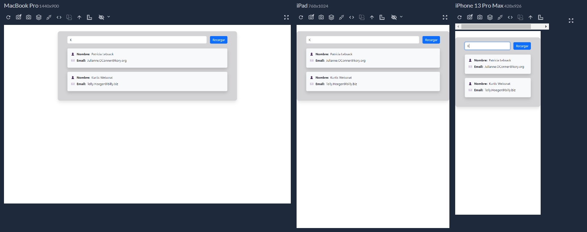
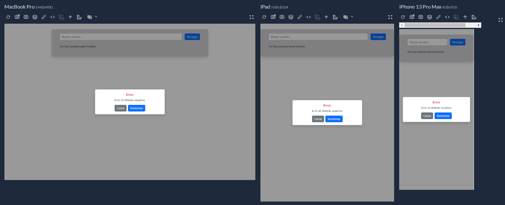
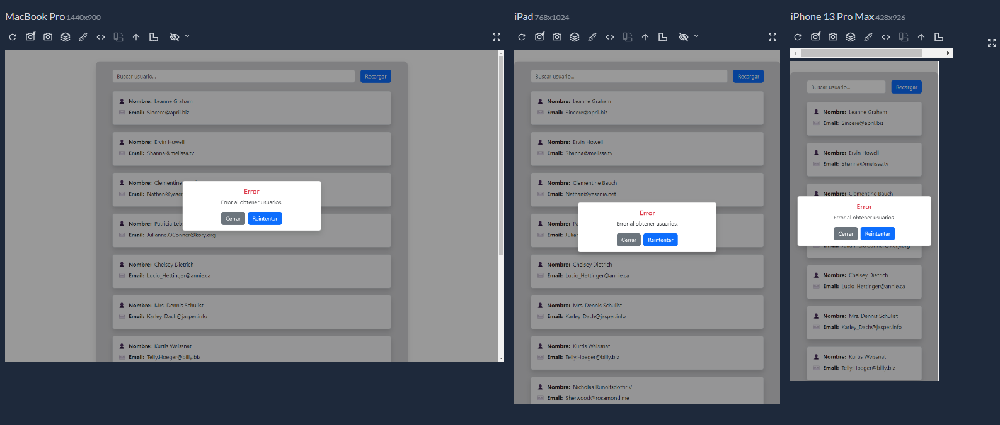

# Gestión de Usuarios - React

## Descripción

Aplicación desarrollada en React que permite consultar, visualizar y buscar usuarios obtenidos desde una API externa.

El proyecto implementa una interfaz dinámica donde los usuarios son mostrados mediante componentes reutilizables, con manejo de estados de carga y errores, búsqueda en tiempo real y una estructura organizada basada en componentes independientes.

La aplicación consume la API pública de usuarios de JSONPlaceholder y adapta la información recibida para mostrarla de forma más flexible.

---

## Tecnologías utilizadas

- **React** - Construcción de la interfaz mediante componentes funcionales.
- **Vite** - Herramienta de desarrollo y construcción del proyecto.
- **JavaScript (ES6+)** - Lógica de la aplicación.
- **Bootstrap 5** - Estilos base y componentes visuales.
- **CSS3** - Estilos personalizados de componentes.
- **Fetch API** - Consumo de datos desde una API externa.

### Hooks utilizados

- `useState` - Manejo del estado de usuarios, búsqueda, carga y errores.
- `useEffect` - Ejecución de efectos secundarios, como la carga inicial de datos y el enfoque automático del buscador.
- `useMemo` - Optimización del filtrado de usuarios.
- `useRef` - Referencia directa al input del buscador.

---

## Estructura del proyecto

```text
src/
│
├── components/
│   │
│   ├── BotonRecargar/
│   │   ├── BotonRecargar.jsx
│   │   └── ...
│   │
│   ├── Buscador/
│   │   ├── Buscador.jsx
│   │   └── ...
│   │
│   ├── ListaUsuarios/
│   │   ├── ListaUsuarios.jsx
│   │   └── ...
│   │
│   ├── UsuarioCard/
│   │   ├── UsuarioCard.jsx
│   │   └── ...
│   │
│   ├── ModalEstado/
│   │   ├── ModalEstado.jsx
│   │   └── ...
│   │
│   └── Usuarios/
│       ├── Usuarios.jsx
│       └── ...
│
├── utils/
│   ├── capitalize.js
│   └── normalizarUsuarios.js
│
├── App.jsx
└── main.jsx
```

---

## Criterios de diseño

### Componentización

La aplicación fue dividida en componentes independientes para mantener una estructura clara y facilitar la reutilización.

Cada componente tiene una responsabilidad específica:

- `Usuarios`: administra la lógica principal y los estados de la aplicación.
- `ListaUsuarios`: renderiza la colección de usuarios.
- `UsuarioCard`: representa cada usuario mediante un componente reutilizable.
- `Buscador`: controla el filtrado de usuarios.
- `BotonRecargar`: gestiona la actualización de datos.
- `ModalEstado`: muestra mensajes de estado o errores.

---

### Renderizado dinámico de usuarios

Los datos recibidos desde la API son normalizados antes de ser utilizados.

`UsuarioCard` no depende de una estructura fija de datos, sino que muestra dinámicamente la información recibida del usuario.

Esto permite agregar nuevos campos provenientes de la API sin necesidad de modificar el componente.

---

### Manejo de estados

La aplicación contempla diferentes estados de ejecución:

- **Carga inicial:** muestra un mensaje mientras se obtienen los datos.
- **Actualización de datos:** mantiene la interfaz mientras se realiza una nueva consulta.
- **Error:** muestra un modal con información del problema y permite volver a intentar la operación.

---

### Separación de responsabilidades

La transformación y adaptación de datos se encuentra separada en funciones auxiliares dentro de `utils`.
Esto evita mezclar lógica de negocio con componentes visuales, manteniendo el código más organizado y fácil de mantener.

---

## Cómo ejecutar el proyecto

### 1. Clonar el repositorio

```bash
git clone https://github.com/f-Ariel-Pavoni/curso-react-js-tp6-API-REST.git
```

### 2. Ingresar al directorio del proyecto

```bash
cd nombre-del-proyecto
```

### 3. Instalar dependencias

```bash
npm install
```

### 4. Ejecutar el proyecto

```bash
npm run dev
```

La aplicación estará disponible en la dirección indicada por Vite.

---

## Capturas de pantalla

### Vista general



### Primera carga



### Vista filtrada

## 

### Error cargando

## 

### Error recargando

## 

## Autor

**Ariel Pavoni**
